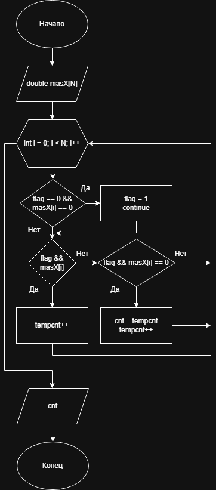

# Домашнее задание к работе 11

## Условие задачи
С одномерным массивом, состоящим из n вводимых с клавиатуры
положительных и отрицательных целых чисел выполнить следующие
вычисления: количество элементов массива, расположенных между первым и
последним нулевыми элементами.
---
## 1. Алгоритм и блок схема

### Алгоритм
1. **Начало**
2. Объявить переменные.
3. Запросить у пользователя массив.
4. В функции в цикле от 0 до размера массива.
5. Если это первый 0 поднимаем флаг и переходим на новую итерацию.
6. Если флаг поднят и элемент отличен от нуля счётчик += 1.
7. Если флаг поднят и элемент = 0 тогда запоминаем счётчик в иную переменную и увеличием счётчик на 1.
8. Выводим результат.
9. **Конец**

### Блок-схема


 [Ссылка на блок-схему](https://viewer.diagrams.net/?tags=%7B%7D&lightbox=1&highlight=0000ff&edit=_blank&layers=1&nav=1&title=Lab11_schema.drawio&dark=auto#Uhttps%3A%2F%2Fdrive.google.com%2Fuc%3Fid%3D1JeRrpwAYPcekXj_KH9_Sv7GGsDUYoSTl%26export%3Ddownload)

 ## 2. Реализация программы

```c
#include <stdio.h>
#include <locale.h>
#define N 10
int main()
{
	int tempcnt = 0,cnt = 0,flag = 0;
	double masX[N];
	setlocale(LC_ALL, "RUS");

	printf("Введите %d чисел через Enter:\n", N);
	for (int i = 0; i < N; i++) {
		scanf("%lf", &masX[i]);
	}

	for (int i = 0; i < N; i++) {
		if (flag == 0 && masX[i] == 0)
		{
			flag = 1;
			continue;
		}
		if (flag && masX[i])
			tempcnt++;
		else if (flag && masX[i] == 0)
		{
			cnt = tempcnt;
			tempcnt++;
		}
	}

	printf("Кол-во элементов массива между между первым и последним нулевыми элементами = %d\n", cnt);
	system("pause");
}
```
# 3. Результаты работы программы
<br>Введите 10 чисел через Enter:
<br>0
<br>4
<br>5
<br>-5
<br>-6
<br>0
<br>-50
<br>4
<br>0
<br>046
<br>Кол-во элементов массива между между первым и последним нулевыми элементами = 7
<br>Для продолжения нажмите любую клавишу . . .
# 4. Информация о разработчике
Авраменко Дмитрий бИПТ-251
